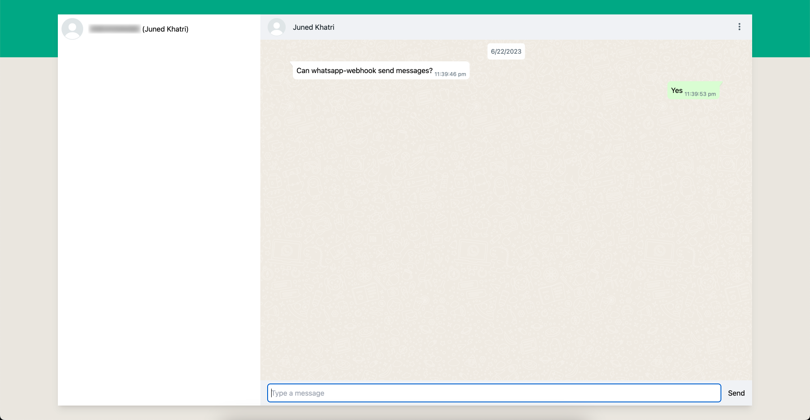

# Receevi - The Open Source WhatsApp Business Solution

## Shape project future with Your Feedback
Help us improve our open-source "Receevi" project! Share your thoughts and suggestions in our community discussion: [Click here](https://github.com/receevi/receevi/discussions/3)

## * IN PROGRESS *

This project is meant to be used as whatsapp cloud api webhook receiver. This project is currently in progress.

## Work done so far
- Login with admin user working
- Contacts list just like in whatsapp web
- Can receive text message
- Can send text message (Other messsage types are yet to be done)


## Roadmap
- User should be able to view received all type of messages


## Installation

### Prerequisites

- Whatsapp cloud API permanent token
    - To generate permanent token, you can follow this popular stackoverflow answer - https://stackoverflow.com/a/74253066

- Facebook app secret
    - Go to https://developers.facebook.com/apps/
    - Choose your app
    - Go to App settings > Basic
    - Get `App secret`

- Phone number ID and WhatsApp Business Account ID
    - Go to https://developers.facebook.com/apps/
    - Choose your app
    - Go to WhatsApp > API Setup
    - Copy "Phone number ID"
    - Copy "WhatsApp Business Account ID"

- Supabase account
    - Create an account and a project on https://supabase.com/
    - Get anon, service_role and project URL from there

- Geenrate random `JWT_SECRET_KEY`
    - `openssl rand -hex 32`

- Generate random `WEBHOOK_VERIFY_TOKEN`
    - `openssl rand -hex 32`

### Vercel setup
- [Deploy to vercel](https://vercel.com/new/git/external?repository-url=https://github.com/receevi/receevi&project-name=receevi&repository-name=receevi)
- Wait till build is finishd and hit Continue to dashbaoard
- Go to Settings > Environment variables
- Add following environment variables
    - `JWT_SECRET_KEY` - JWT secret key you generated in prerequisites
    - `WEBHOOK_VERIFY_TOKEN` - Whatsapp webhook verify token you generated in prerequisites
    - `WHATSAPP_ACCESS_TOKEN` - Whatsapp cloud API permanent token
    - `FACEBOOK_APP_SECRET` - Facebook app secret
    - `NEXT_PUBLIC_SUPABASE_URL` - Supabase project URL
    - `NEXT_PUBLIC_SUPABASE_ANON_KEY` - Supabase anon key
    - `SUPABASE_SERVICE_ROLE` - Supabase service role
    - `WHATSAPP_API_PHONE_NUMBER_ID` - Phone number ID
    - `WHATSAPP_BUSINESS_ACCOUNT_ID` - WhatsApp Business Account ID
- Go to `Deployment`
- Click on three dot icon on last deployment and click "Redeploy" to refersh environment variables

### Supabase setup
- Create account at https://supabase.com/
- Create a project
- Clone this repository in your Computer
    - `git clone https://github.com/receevi/receevi.git`
- Install supabase cli from here - https://supabase.com/docs/guides/cli
- Go to https://app.supabase.com/account/tokens and generate access token
- Login into supabase cli
    ```
    supabase login
    ```
    - Paste access token in this command
- Link supabase account (Reference Id can be found in Project Settings)
    ```bash
    supabase link --project-ref <Reference Id>
    ```
    - Get Reference Id from Supabase > Project Settings > General
- Create database schema
    ```bash
    supabase db push
    ```
- Create database schema
    ```bash
    supabase functions deploy
    ```
- Go to Supabase > Authentication > Add user > Create New User
- Enter email address and new password to create a user
- Go to Supabase > Project Settings > Edge Functions
- Add 2 new secrets
    - Secret name: `WHATSAPP_ACCESS_TOKEN`
    - Value: Whatsapp webhook verify token you generated in prerequisites
    - Secret name: `WHATSAPP_BUSINESS_ACCOUNT_ID`
    - Value: WhatsApp Business Account ID taken from developer console

### Whatsapp setup
- Go to https://developers.facebook.com/apps/
- Select App
- Go to Whatsapp > Configuration
- Under Webook, click Edit button
- Add callback URL
    - URL will be Vercel's deployment + `/webhook`
    - If your webhook deployment URL is `https://some-project.vercel.app/` then Callback URL will be `https://some-project.vercel.app/webhook`
- Add Verify token from environment variable `WEBHOOK_VERIFY_TOKEN`
- Click Verify and save
- Under Webhook fields click Manage
- Click subscribe checkbox in messages row and hit Done


### Test the integration
- Send test message to the whatsapp number
- Visit deplyoment URL
- See if message is received


## Running locally

- Copy `.env.example` into `.env.local`
- Fill all environment variables in `.env.local`
- Run the development server:
    ```bash
    npm run dev
    ```
- Open [http://localhost:3000](http://localhost:3000) with your browser to see the result.


## Disclaimer
This project is not affiliated with Whatsapp Inc. Whatsapp is a registered trademark of Whatsapp, Inc.
