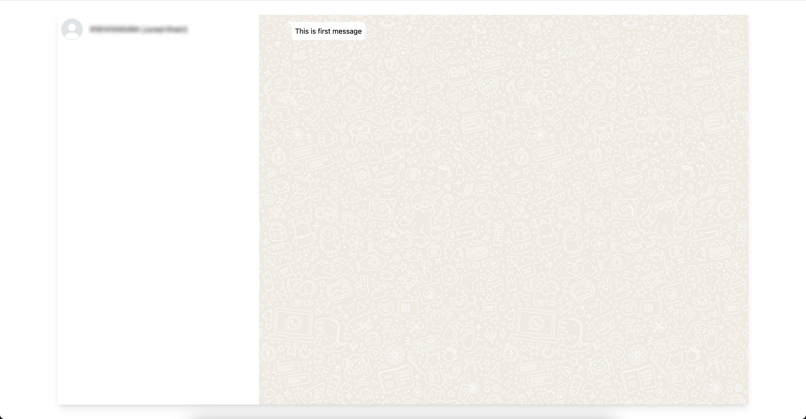

# Whatsapp Webhook

## * IN PROGRESS *

This project is meant to be used as whatsapp cloud api webhook receiver. This project is currently in progress.

## Work done so far
- Login with admin user working
- Contacts list just like in whatsapp web
- Text message is visible (Other messsage types are yet to be done)


## Roadmap
- User should be able to view received all type of messages

## Getting Started

First, run the development server:

```bash
npm run dev
# or
yarn dev
```

Open [http://localhost:3000](http://localhost:3000) with your browser to see the result.
